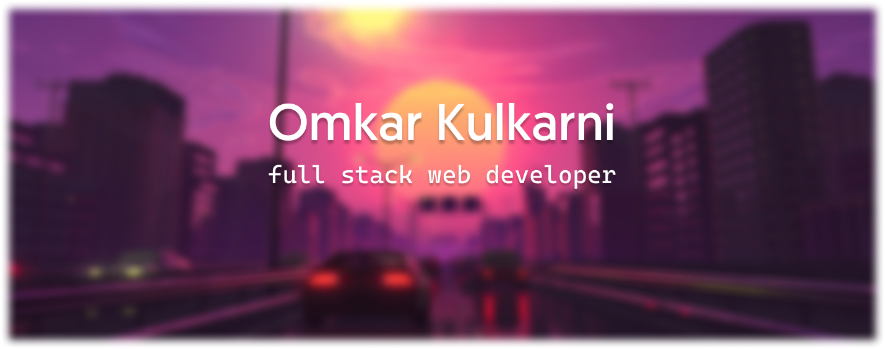

    <h2>Hi There 👋</h2>
    </img>

## I'm a Student Developer 🎓

- 🔭 I’m currently working on backend projects
- 🥅 2020 Goals: Contribute more to Open Source projects
- ⚡ Fun fact: I love dogs ! 🐶

### Connect with me:

[][website]
[][twitter]
[][linkedin]
[][instagram]

[website]: https://omkark45.github.io/
[twitter]: https://twitter.com/omkar_k45
[instagram]: https://instagram.com/omkar_k45
[linkedin]: https://www.linkedin.com/in/omkar-kulkarni-ab7a32191/
